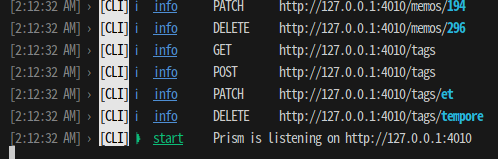

## 開発環境作成
1, dockerをインストール

2, プロジェクトディレクトリ下で以下を実行

```bash
docker compose run --rm nextjs yarn
```

3, プロジェクトディレクトリをVScodeで開く

4, Dev Containerの拡張機能をインストールしていなければインストールする

5, F1を押し、コマンドパレットから「コンテナで再度開く」を押す

6, コンソールで以下を実行
```bash
bin/setup
rails db:setup
rails db:seed
```

7, 以下を実行してサーバーを立ち上げ
```bash
rails s -b 0.0.0.0
```

ローカル環境は以下のURL
http://localhost:4000/

### モックサーバーを導入
1, プロジェクトディレクトリで以下を実行
```bash
npm install -g @stoplight/prism-cli
```

2,
以下を実行してモックサーバー起動
```bash
prism mock openapi/openapi.yml
```
